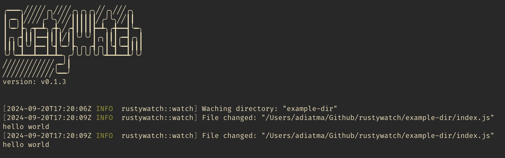

# RustyWatch

   



Live reloading inspired by https://github.com/air-verse/air/tree/master build with Rust.

## Features

- Live reloading for any programing languages
- Better building process
- Allow watching new directories
- Colorful log output

## Install

```shell
cargo install rustywatch
```

## Usage

```shell
rustywatch -d . -c "echo 'Files changes!'" --ignore .git --ignore ./tmp
```

- Example using with Rust (cargo)

```shell
# create new project
cargo new hello-world;
cd hello-world;
# run rustywatch in `./src` directory
rustywatch -d './src' -c 'cargo run'
```

- Example using with Go
```shell
# create new project
mkdir hello-world;
cd hello-world;
# init go module
go mod init go-project;
# create file main.go
touch main.go;
# edit file main.go
vim main.go
# and run the project with rustywatch
# then the project will be running with hot reload.
rustywatch -d . -c 'go run main.go' --ignore .git
```

- Example using with NodeJS
```shell
# create new project
mkdir hello-world;
cd nodejs-project;
# create index.js
touch index.js
# edit file index.js and and run the project with rustywatch 
vim index.js
# then the project will be running with hot reload
rustywatch -d . -c 'node index.js' --ignore '.tmp' --ignore '.git'
```

## Star History

[](https://star-history.com/#ak9024/rustywatch&Date)
## License

MIT & Apache-2.0
