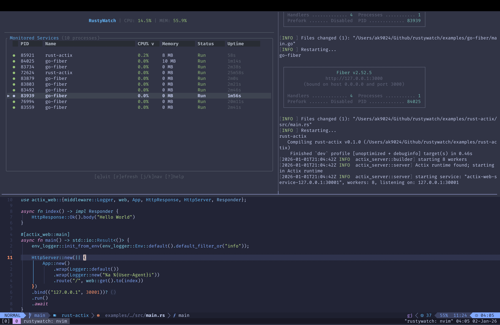

# RustyWatch


  




## Live Reloading Built with Rust

Inspired by [Go Air](https://github.com/air-verse/air), RustyWatch provides powerful live reloading capabilities designed for developers working across various programming languages.

## Features

- **Universal Live Reloading:** Supports live reloading for any programming language (Go, Rust, Node.js, Python, and more).
- **Real-time Binary Reloading:** Automatically rebuilds and restarts your binaries on file changes.
- **Monorepo & Multi-Project Support:** Run multiple projects concurrently with a single command.
- **Process Monitoring Dashboard:** Built-in terminal UI (`--monitor`) with real-time CPU/memory tracking, process management, and system metrics.
- **Smart File Filtering:** Intelligent ignore patterns with glob matching for common build artifacts (.git, node_modules, target/, etc.).
- **Async & High Performance:** Non-blocking async I/O with Tokio, event debouncing, and efficient data structures.
- **Cross-Platform:** Works on macOS, Linux, and Windows.
- **Flexible Configuration:** YAML-based config or CLI arguments for quick usage.

## Install

### Using Cargo

> curl --proto '=https' --tlsv1.2 -sSf <https://sh.rustup.rs> | sh

```shell
cargo install --git https://github.com/ak9024/rustywatch rustywatch
```

### Using Homebrew

```shell
# Add the tap
brew tap ak9024/rustywatch
# Install rustywatch
brew install rustywatch
```

## Usage

To start the project, ensure you have a `rustywatch.yaml` configuration file in the root directory of your project. Then, run the CLI from the root directory to launch RustyWatch.

## Configuration

The default configuration file is named `rustywatch.yaml`, and it must be located in your project's root directory. For a reference configuration, please see the example below:

```yaml
# define workspaces, rustywatch can be handled multi project at the same time.
workspaces:
  # first project binary apps
  - dir: 'golang-project' # define path directory
    cmd: # define command to build binary
    - cp ./golang-project/.env .env
    - |
      cd ./golang-project;
      go build main.go
    bin_path: './golang-projec/main' # define path for binary location
    bin_arg: # define arguments
     - server
    ignore:
     - '.git'
  # second project binary apps
  - dir: 'rust-project'
    cmd:
    - |
      cd ./rust-project;
      cargo build
    bin_path: './rust-project/target/debug/rust-project'
  # third project non binary apps
  - dir: 'nodejs-project'
    cmd: 'cd nodejs-project;npm run dev'
  # more ...
```

```shell
# list directories
ls 
.
└── your-project/
    ├── go-project/
    │   ├── go.mod
    │   ├── go.sum
    │   └── main.go
    ├── rust-project/
    │   ├── src/
    │   │   └── main.rs
    │   ├── Cargo.toml
    │   └── Cargo.lock
    ├── nodejs-project/
    │   ├── index.js
    │   ├── package.json
    │   └── package-lock.json
    └── rustywatch.yaml (config here)
```

### Run the project

```shell
rustywatch
```

## Help

```
rustywatch --help
```

## Update version

```shell
cargo install rustywatch
```

## Testing

### Run all tests

```shell
cargo test
```

### Run unit tests only

```shell
cargo test --lib
```

### Run integration tests only

```shell
cargo test --test '*'
```

### Run with code coverage

> Requires `cargo-llvm-cov`: `cargo install cargo-llvm-cov`

```shell
cargo llvm-cov
```

### Run benchmarks

```shell
cargo bench
```

## Support languages

- Go
- Rust
- Bun
- Node.js
- (more)

## Star History

<a href="https://star-history.com/#ak9024/rustywatch&Timeline">
 <picture>
   <source media="(prefers-color-scheme: dark)" srcset="https://api.star-history.com/svg?repos=ak9024/rustywatch&type=Timeline&theme=dark" />
   <source media="(prefers-color-scheme: light)" srcset="https://api.star-history.com/svg?repos=ak9024/rustywatch&type=Timeline" />
   
 </picture>
</a>

## License

MIT & Apache-2.0
